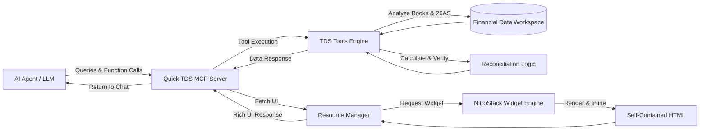

# QuickTDS MCP Server

Quick TDS is a high-performance Model Context Protocol (MCP) server built on top of the NitroStack framework. It provides specialized AI agents with tools, resources, and UI widgets to streamline Tax Deducted at Source (TDS) credit reconciliation and recovery workflows.

By leveraging MCP, Quick TDS enables large language models (LLMs) to perform complex tax data analysis, load corporate financial documents, identify discrepancies in Form 26AS, and directly render interactive reconciliation reports as rich UI widgets directly in the AI chat interface.

## About the Project

The Quick TDS MCP server is designed to bridge the gap between raw corporate financial data and actionable AI insights. Reconciling company books with government tax records (such as Form 26AS) is traditionally a manual, error-prone process. 

This project automates the workflow by providing AI models with direct access to structured financial data and the ability to project reconciliation interfaces. The AI can load workspaces, evaluate records, suggest corrections, and verify updates in real-time, drastically reducing the time required to close tax recovery cases.

## Architecture

## Core Capabilities

Quick TDS bridges the gap between raw financial data and AI-driven insights by providing structural tools and visual resources.

### Intelligent Tools
AI Agents can call these tools to perform actions on behalf of the user, enabling autonomous reconciliation:
* `load_quick_tds_demo`: Bootstraps the environment with a comprehensive sample workspace, loading simulated invoices, payments, bank receipts, and Form 26AS data for testing.
* `get_tds_workspace`: Retrieves the current state of a TDS reconciliation workspace for the AI to analyze.
* `record_tds_correction`: Allows the AI to record a correction for a specific TDS discrepancy found in the books.
* `verify_refreshed_26as`: Verifies whether a newly fetched Form 26AS matches the expected corrections and updates the status.

### Interactive UI Resources
The server dynamically provides rendered HTML widgets that the AI can seamlessly display to the user, providing a rich visual experience beyond text:
* `ui://widget/next-upload-summary.html`: A visual dashboard displaying an overview of uploaded corporate financial documents.
* `ui://widget/next-reconciliation.html`: An interactive reconciliation table matching internal company books against government Form 26AS data.
* `ui://widget/next-recovery-cases.html`: A detailed view of pending tax recovery cases, highlighting discrepancies and actionable steps.
* `ui://widget/next-resolution.html`: Displays resolution outcomes and final statuses for corrected tax entries.

## Technical Design

This project consists of two tightly coupled components designed for maximum compatibility with sandboxed MCP clients:

1. The MCP Server Engine: A robust TypeScript application built with NitroStack. It handles the core MCP protocol, executes tools, and routes UI resources.
2. The Widget Rendering Engine: A rendering application that builds NitroStack widgets into static HTML. Because MCP clients often render UI resources inside restricted iframe elements, external CSS and JavaScript files cannot be reliably loaded. Our custom post-build pipeline automatically parses the output and inlines all linked stylesheets and JavaScript chunks directly into the HTML. This guarantees that the widgets render perfectly styled in any AI chat interface.

## Setup and Installation

Please refer to the Setup Guide (setup.md) for detailed instructions on:
- Installation prerequisites
- Environment configuration
- Running the dual-server environment
- Connecting specific AI clients using the correct endpoints

## License
Copyright 2026 NitroStack. All rights reserved.
